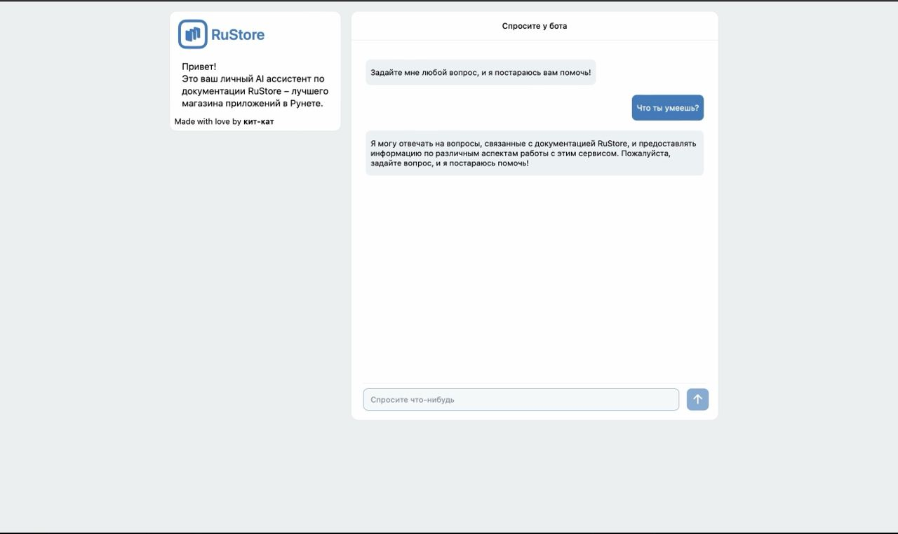
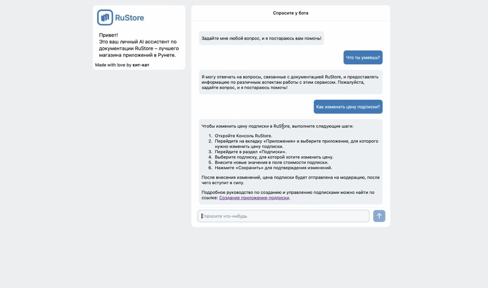
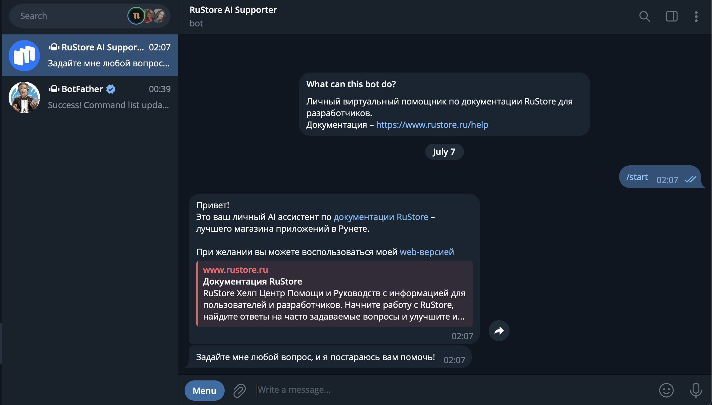
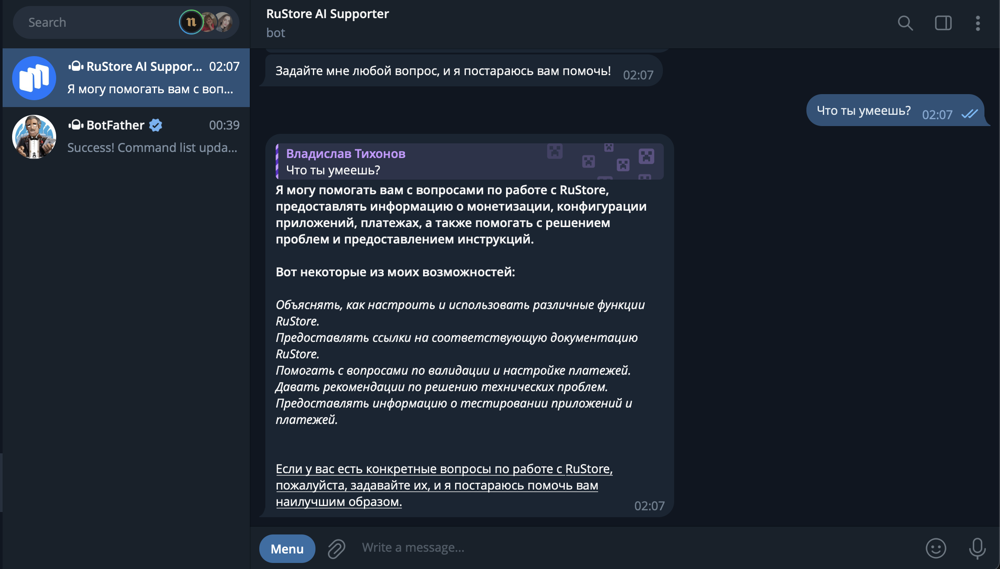
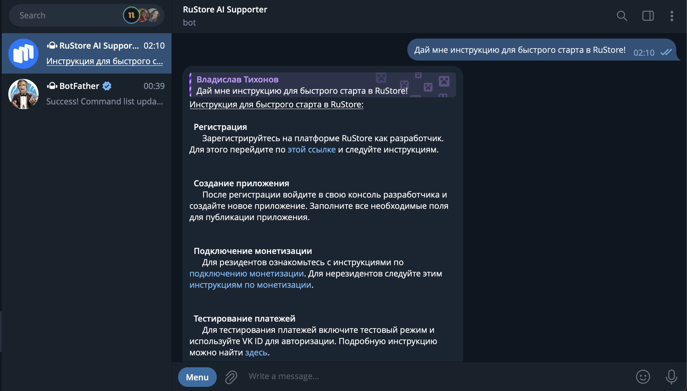

<p align="center">
      <br/>
     <H2 align="center">Команда Kit-kat</H2> 
    <H2 align="center">Кейс "Вопросно-ответная система по технической документации"</H2> 
</p>

<a target="_blank" href="https://cookiecutter-data-science.drivendata.org/">
    
</a>


Описание проекта

Этот репозиторий содержит исходный код и ресурсы для веб-сервиса, который собирает информацию и генерирует ответы на вопросы пользователей, анализируя текст и/или код, с возможностью регулярного дообучения


Архитектура решения
Технологии
- ML Pipline: ruRoBERTa-large, CatBoost, YandexGPT 3
- Веб-приложение: React, Node JS
- Брокер сообщений: RabbitMQ
- Хранение данных: MongoDb 


Использование
+ 1 вариант
  - Перейдите по [ссылке](http://147.45.139.59/) и наслаждайтесь web-сервисом
  - 
+ 2 вариант, в docker
  - Клонируйте репозиторий: ```git clone https://github.com/ikanam-ai/Qna-system-for-technical-documentation.git```
  - перейдите в папку scfo: ```cd scfo```
  - запустить все миикросервисы из docker-compose: ```docker-compose up```
+ 3 вариант
  - Перейдите по [ссылке](https://t.me/rustore_doc_bot) и наслаждайтесь TG-ботом
    
  


# Пример работы web-сервиса

***Часть 1:***

<p align="center">
      <br/>
</p>

***Часть 2:***

<p align="center">
      <br/>
</p>


# Пример работы TG-бота

***Часть 1:***

<p align="center">
      <br/>
</p>

***Часть 2:***

<p align="center">
      <br/>
</p>

***Часть 3:***

<p align="center">
      <br/>
</p>


---


A short description of the project.

## Project Organization

```

├── data
│
│
├── models             <- Trained and serialized models, model predictions, or model summaries
│
├── notebooks          <- Jupyter notebooks. Naming convention is a number (for ordering),
│                         the creator's initials, and a short `-` delimited description, e.g.
│                         `1.0-jqp-initial-data-exploration`.
│
├── pyproject.toml     <- Project configuration file with package metadata for scfo
│                         and configuration for tools like black
│
│
│
├── requirements.txt   <- The requirements file for reproducing the analysis environment, e.g.
│                         generated with `pip freeze > requirements.txt`
│
├── setup.cfg          <- Configuration file for flake8
│
└── scfo                <- Source code for use in this project.
    │
    ├── __init__.py    <- Makes scfo a Python module
    │
    ├── data           <- Scripts to download or generate data
    │   └── make_dataset.py
    │
    ├── features       <- Scripts to turn raw data into features for modeling
    │   └── build_features.py
    │
    ├── models         <- Scripts to train models and then use trained models to make
    │   │                 predictions
    │   ├── predict_model.py
    │   └── train_model.py
    │
    └── visualization  <- Scripts to create exploratory and results oriented visualizations
        └── visualize.py
```

--------

